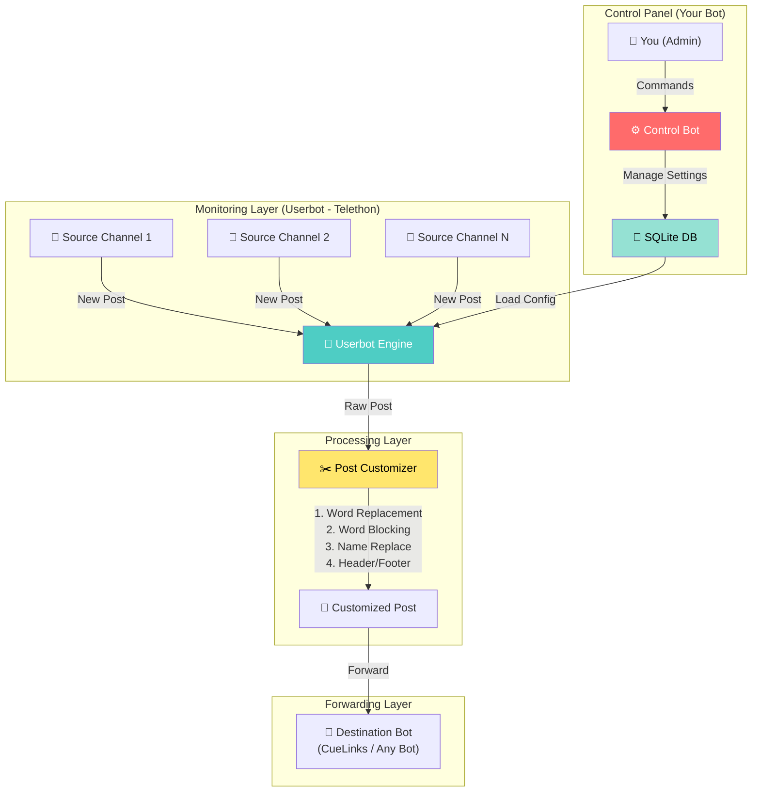
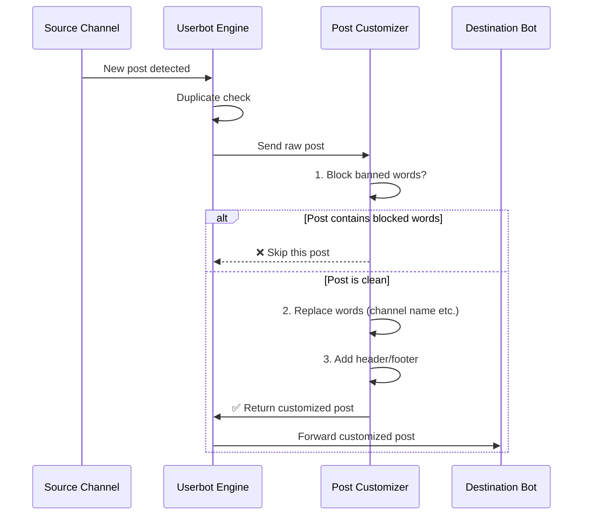

# Telegram Auto-Forwarding Userbot — Full Customizable

## 🎯 Goal

एक **Telegram Userbot** बनाना जो:
1. **किसी भी source channel** से new posts monitor करे
2. Posts को **customize** करे (words replace, block, channel name change)
3. Customized post **किसी भी bot** (CueLinks या कोई भी) पर auto-forward करे
4. सारा setup **अपने Telegram bot** से manage करो (commands से)
5. **24×7** चलता रहे

---

## 🏗️ Architecture



### Message Flow



---

## ⚙️ Two Components

### Component 1: Userbot (Telethon) — Monitoring & Forwarding
- Source channels monitor करेगा (user account से)
- Posts customize करेगा
- Destination bot को forward करेगा
- **जरूरी:** `API_ID`, `API_HASH`, Phone number

### Component 2: Control Bot (python-telegram-bot) — Admin Panel
- `@BotFather` से बना हुआ normal bot
- तुम commands भेजकर सारी settings manage करोगे
- सिर्फ Admin (तुम) use कर सकोगे

---

## 🎮 Control Bot Commands (तुम्हारा Admin Panel)

### Source Channel Management
| Command | काम |
|---------|-----|
| `/add_source @channel` | Source channel add करो |
| `/remove_source @channel` | Source channel हटाओ |
| `/list_sources` | सभी source channels देखो |

### Destination Bot Management
| Command | काम |
|---------|-----|
| `/set_dest @BotUsername` | Destination bot set करो (जिस पर forward होगा) |
| `/show_dest` | Current destination bot देखो |

### Post Customization
| Command | काम |
|---------|-----|
| `/add_replace OldWord➜NewWord` | Word replacement rule add करो |
| `/remove_replace OldWord` | Replacement rule हटाओ |
| `/list_replaces` | सभी replacement rules देखो |
| `/add_block BadWord` | Post में ये word हो तो skip करो |
| `/remove_block BadWord` | Block rule हटाओ |
| `/list_blocks` | सभी blocked words देखो |
| `/set_header Text` | हर post के ऊपर text add करो |
| `/set_footer Text` | हर post के नीचे text add करो |
| `/clear_header` | Header हटाओ |
| `/clear_footer` | Footer हटाओ |

### Bot Control
| Command | काम |
|---------|-----|
| `/status` | Bot running status, source count, forwarded count |
| `/pause` | Forwarding temporarily pause |
| `/resume` | Forwarding resume |
| `/stats` | Statistics — कितनी posts forward हुई, कितनी skip |

---

## ✂️ Post Customization Engine — Examples

### Example 1: Channel Name Replace
```
Source post:  "🔥 Best Deal by @DealsChannel — Amazon Sale 50% off!"
Rule:         /add_replace @DealsChannel➜@MyChannel

Result:       "🔥 Best Deal by @MyChannel — Amazon Sale 50% off!"
```

### Example 2: Block Words
```
Source post:  "Join @DealsChannel for more deals"
Rule:         /add_block "Join @DealsChannel"

Result:       ❌ Post SKIPPED (contains blocked phrase)
```

### Example 3: Word Remove (Replace with empty)
```
Source post:  "🔥 Deal by @OtherGuy\nBuy now! Follow @OtherGuy"
Rule:         /add_replace @OtherGuy➜

Result:       "🔥 Deal by \nBuy now! Follow "
```

### Example 4: Header + Footer
```
Source post:  "iPhone 50% off on Amazon!"
Header:       /set_header "📢 @MyDealsChannel"
Footer:       /set_footer "🔔 Join @MyDealsChannel for more!"

Result:       "📢 @MyDealsChannel
              iPhone 50% off on Amazon!
              🔔 Join @MyDealsChannel for more!"
```

---

## 📂 Project Structure

```
telegram-autoforwarding/
├── config.json                    # [NEW] Base config (API keys, admin ID)
├── bot.py                         # [NEW] Main entry - runs both userbot + control bot
├── userbot/
│   ├── __init__.py                # [NEW]
│   ├── engine.py                  # [NEW] Telethon userbot - monitor & forward
│   └── customizer.py              # [NEW] Post customization engine
├── controlbot/
│   ├── __init__.py                # [NEW]
│   ├── bot.py                     # [NEW] Control panel bot (python-telegram-bot)
│   └── handlers.py                # [NEW] All command handlers
├── database/
│   ├── __init__.py                # [NEW]
│   └── db.py                      # [NEW] SQLite - sources, rules, stats, history
├── utils/
│   ├── __init__.py                # [NEW]
│   └── logger.py                  # [NEW] Logging setup
├── requirements.txt               # [NEW] Dependencies
├── .env.example                   # [NEW] Environment variables template
├── setup_guide.md                 # [NEW] Step-by-step setup guide (Hindi + English)
└── deploy/
    └── telegram-bot.service       # [NEW] systemd service file for 24/7
```

---

### Component Details

#### [NEW] `config.json` — Base Configuration
```json
{
  "api_id": "YOUR_API_ID",
  "api_hash": "YOUR_API_HASH", 
  "phone": "+91XXXXXXXXXX",
  "bot_token": "YOUR_CONTROL_BOT_TOKEN",
  "admin_id": 123456789
}
```
> सिर्फ ये 5 fields manually fill करने हैं, बाकी सब bot commands से manage होगा

---

#### [NEW] `userbot/engine.py` — Monitoring Engine
- Telethon client start करेगा
- Database से source channels load करेगा
- `NewMessage` event handler register करेगा
- Post customizer से process करवाकर destination bot को forward करेगा
- Media (images, videos) भी forward करेगा

---

#### [NEW] `userbot/customizer.py` — Post Customization Engine
**Processing pipeline (order matters):**
```
Raw Post → Block Check → Word Replacements → Add Header → Add Footer → Done
```

Features:
1. **Word/Phrase Replacement** — किसी भी word को किसी भी word से replace
2. **Word Blocking** — blocked word वाली post skip
3. **Header/Footer** — हर post में ऊपर/नीचे text add
4. **Empty lines cleanup** — extra blank lines हटाना
5. **Caption handling** — media posts के captions भी customize

---

#### [NEW] `controlbot/bot.py` + `handlers.py` — Admin Control Panel
- `@BotFather` से बनाया हुआ regular bot
- सिर्फ `admin_id` respond करेगा (security)
- सभी commands (ऊपर table में listed)
- Inline keyboards for confirmations
- Real-time status updates

---

#### [NEW] `database/db.py` — SQLite Database
**Tables:**
| Table | Purpose |
|-------|---------|
| `source_channels` | Source channel IDs/usernames |
| `destination` | Current destination bot |
| `replace_rules` | Word replacement rules |
| `block_rules` | Blocked words/phrases |
| `settings` | Header, footer, pause status |
| `forward_history` | Log of forwarded posts (for stats & dedup) |

---

## 🔐 Prerequisites

> [!IMPORTANT]
> ### Setup से पहले ये करो:
> 
> | # | Step | कैसे करें |
> |---|------|-----------|
> | 1 | **Telegram API Credentials** | [my.telegram.org](https://my.telegram.org) → `API ID` + `API Hash` लो |
> | 2 | **Control Bot बनाओ** | Telegram पर `@BotFather` → `/newbot` → Bot Token कॉपी करो |
> | 3 | **अपनी Telegram ID लो** | `@userinfobot` को message करो → अपनी numeric ID कॉपी करो |
> | 4 | **Source Channels join करो** | जिन channels से posts लेनी हैं, उनमें member बनो |
> | 5 | **Python 3.10+** install करो | System पर Python होना चाहिए |
> | 6 | **CueLinks Bot setup** (optional) | अगर CueLinks use करना है तो `/start` → `/login` → `/channel_id` → `/enable_autoposting` |

---

## ⚠️ User Review Required

> [!WARNING]
> ### Account Ban Risk  
> Userbot (Telethon) personal account use करता है। बहुत ज्यादा तेज़ forward करने से Telegram account ban हो सकता है।
> **Solution:** 3-5 second delay रखेंगे messages के बीच। Secondary phone number recommend है।

> [!IMPORTANT]
> ### CueLinks Auto-Posting Dependency
> CueLinks bot का auto-posting feature ON होना चाहिए। मतलब:
> - तुम्हारा userbot post CueLinks bot को forward करेगा
> - CueLinks bot अपने आप affiliate link बनाकर तुम्हारे channel पर post करेगा
> - **यह CueLinks bot की responsibility है, हमारा bot सिर्फ forward करता है**

---

## ❓ Open Questions

> [!IMPORTANT]
> 1. **Secondary Phone:** क्या तुम्हारे पास secondary phone number है userbot के लिए? (Main account ban risk से बचने के लिए)
> 
> 2. **Media Forwarding:** Images/videos भी forward करनी हैं या सिर्फ text posts?
> 
> 3. **Multiple Destination Bots:** एक ही destination bot काफी है या multiple bots पर forward करना है?

---

## ✅ Verification Plan

### Automated Tests
```bash
# URL extractor tests
python -m pytest tests/test_customizer.py

# Database operations tests  
python -m pytest tests/test_db.py
```

### Manual Testing
1. Control bot से `/add_source @testchannel` → verify add हो गया
2. Test channel में post डालो → verify destination bot पर forward हो
3. `/add_replace OldWord➜NewWord` → verify replacement काम कर रहा
4. `/add_block BadWord` → verify blocked post skip हो रही
5. `/status` → verify stats सही दिख रहे
6. Bot restart → verify सभी settings persist हैं (SQLite)
7. 1 hour continuous run → logs check, no errors